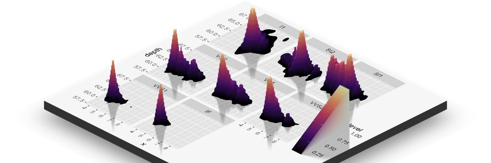

Accompanying repository of the twitter account [data science question a day](https://twitter.com/data_question). This is a social experiment to teach about data science using twitter. Every day a question is posted on the account related to datas science with options in poll format. The answer to the question is posted next day, mostly after 12-14 hours.

You can use the following links to access the questions and answers and if you like my work you can support it by <a href='https://www.buymeacoffee.com/NgFs2zX'>buying a coffee</a>

| Question Number | Date | Link |
| :---: | :---: | :---: |
| 19 | 10-11-2019 | [Question](https://mohit2152sharma.github.io/Data-Science-Question-A-Day/questions/10112019_19_R/10112019_19_R.html) |
| 20 | 11-11-2019 | [Question](https://mohit2152sharma.github.io/Data-Science-Question-A-Day/questions/11112019_20_DS/11112019_20_DS.html) |
| 21 | 12-11-2019 | [Question](https://mohit2152sharma.github.io/Data-Science-Question-A-Day/questions/12112019_21_DS/12112019_21_DS.html) |
| 22 | 13-11-2019 | [Question](https://mohit2152sharma.github.io/Data-Science-Question-A-Day/questions/13112019_22_R/13112019_22_R.html) |
| 23 | 14-11-2019 | [Question](https://mohit2152sharma.github.io/Data-Science-Question-A-Day/questions/14112019_23_DS/14112019_23_DS.html) |
| 24 | 15-11-2019 | [Question](https://mohit2152sharma.github.io/Data-Science-Question-A-Day/questions/15112019_24_R/15112019_24_R.html) |
| 25 | 16-11-2019 | [Question](https://mohit2152sharma.github.io/Data-Science-Question-A-Day/questions/16112019_25_R/16112019_25_R.html) |
| 28 | 20-11-2019 | [Question](https://mohit2152sharma.github.io/Data-Science-Question-A-Day/questions/20112019_28_R/20112019_28_R.html) |
| 29 | 21-11-2019 | [Question - if and ifelse in R](https://mohit2152sharma.github.io/Data-Science-Question-A-Day/questions/21112019_29_R/21112019_29_R.html) |
| 30 | 22 November 2019 | [Question - Variable Scoping in R](https://mohit2152sharma.github.io/Data-Science-Question-A-Day/questions/22112019_29_R/22112019_30_R.html) |
| 31 | 23-11-2019 | [Question - Super Assignment operator in R](https://mohit2152sharma.github.io/Data-Science-Question-A-Day/questions/23112019_31_R/23112019_31_R.html) |
| 32 | 24 November 2019 | [Scoping in R](https://mohit2152sharma.github.io/Data-Science-Question-A-Day/questions/24112019_R/24112019_R.html) |
| 33 | 25 November 2019 | [Bootstrap](https://mohit2152sharma.github.io/Data-Science-Question-A-Day/questions/25112019_DS/25112019_DS.html) |
| 34 | 26 November 2019 | [Conditional Probability](https://mohit2152sharma.github.io/Data-Science-Question-A-Day/questions/26112019_DS/26112019_DS.html) |
| 35 | 27 November 2019 | [Subsetting in R](https://mohit2152sharma.github.io/Data-Science-Question-A-Day/questions/27112019_R/27112019_R.html) |
| 36 | 28 November 2019 | [Environments in R](https://mohit2152sharma.github.io/Data-Science-Question-A-Day/questions/28112019_R/28112019_R.html) |
| 37 | 29 November 2019 | [Conditional Probability](https://mohit2152sharma.github.io/Data-Science-Question-A-Day/questions/29112019_DS/29112019_DS.html) |
| 38 | 03 December 2019 | [Independence](https://mohit2152sharma.github.io/Data-Science-Question-A-Day/questions/03122019_DS/03122019_DS.html) |
| 39 | 04 December 2019 | [Interpreting Linear and Logistic Regression](https://mohit2152sharma.github.io/Data-Science-Question-A-Day/questions/04122019_DS/04122019_DS.html) |
| 40 | 05 December 2019 | [CDF of Normal Distribution](https://mohit2152sharma.github.io/Data-Science-Question-A-Day/questions/05122019_DS/05122019_DS.html) |
| 41 | 06 December 2019 | [Normal Distribution](https://mohit2152sharma.github.io/Data-Science-Question-A-Day/questions/06122019_DS/06122019_DS.html) |
| 42 | 07 December 2019 | [data.frame's drop argument in R](https://mohit2152sharma.github.io/Data-Science-Question-A-Day/questions/07122019_R/07122019_R.html) |
| 43 | 08 December 2019 | [Expectations](https://mohit2152sharma.github.io/Data-Science-Question-A-Day/questions/08122019_DS/08122019_DS.html) |
| 44 | 09 December 2019 | [Correlation coefficient](https://mohit2152sharma.github.io/Data-Science-Question-A-Day/questions/09122019_DS/09122019_DS.html) |
| 45 | 10 December 2019 | [Uniform Distribution](https://mohit2152sharma.github.io/Data-Science-Question-A-Day/questions/10122019_DS/10122019_DS.html) |
| 46 | 11 December 2019 | [Matrices in R](https://mohit2152sharma.github.io/Data-Science-Question-A-Day/questions/11122019_R/11122019_R.html) |
| 47 | 12 December 2019 | [Linear Least Squares Fitting](https://mohit2152sharma.github.io/Data-Science-Question-A-Day/questions/12122019_DS/12122019_DS.html) |
| 48 | 13 December 2019 | [Linear Reg- Sum of residuals](https://mohit2152sharma.github.io/Data-Science-Question-A-Day/questions/13122019_DS/13122019_DS.html) |
| 49 | 14 December 2019 | [R square and independent variables](https://mohit2152sharma.github.io/Data-Science-Question-A-Day/questions/14122019_DS/14122019_DS.html) |
| 50 | 15 December 2019 | [Outliers in Linear Reg](https://mohit2152sharma.github.io/Data-Science-Question-A-Day/questions/15122019_DS/15122019_DS.html) |
| 51 | 22 November 2019 | [Question 30: Variable Scoping](https://mohit2152sharma.github.io/Data-Science-Question-A-Day/questions/22112019_30_R/22112019_30_R.html) |